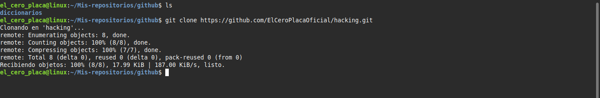
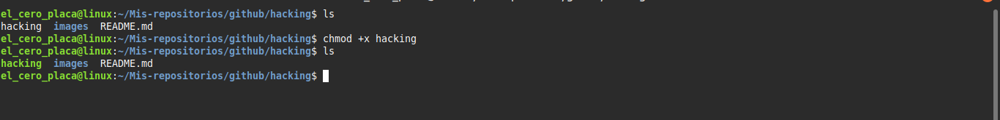
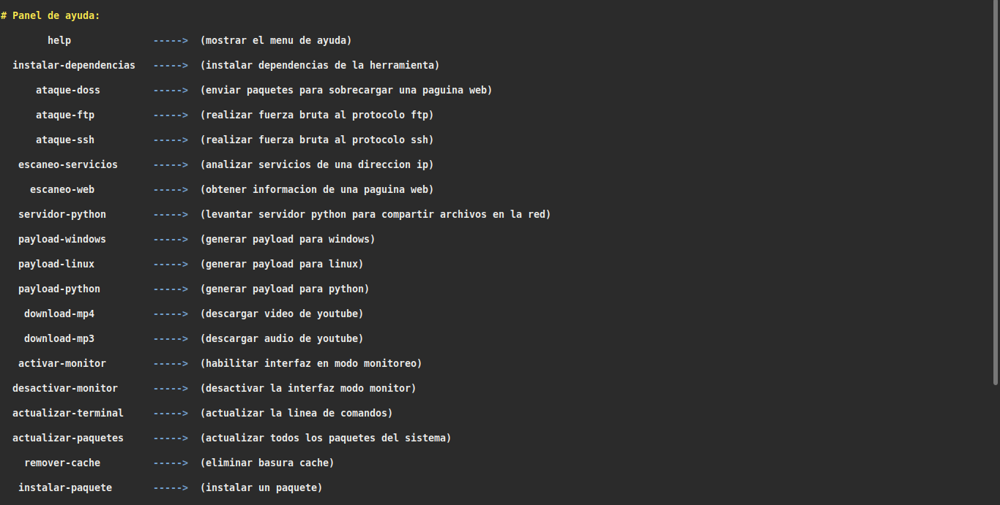

# Multi-Hacking
sencilla herramienta creada en bash con varias opciones disponibles como el escaneo de servicios,ataque doss,ataque de fuerza bruta,escaneo de pagina web,fuzzing web,automatizacion del sistema instalacion de herramientas y generador de payloads. utilizando nmap,gobuster,arp-scan,hydra,hping3 y python3 etc..!

# Instalacion.
Clonar el repositorio.
`git clone https://github.com/ElCeroPlacaOficial/Multi-Hacking.git`

Ubicate en el nuevo directorio llamado Multi-Hacking.
`cd Multi-Hacking && ls`

Despues otorga los permisos necesarios con el siguiente comando.
`chmod +x hacking`

Y por ultimo ejecuta la herramienta con el comando.
`bash hacking`

Y listo asi de sencillo es instalar Multi-Hacking.

# Captura de pantalla de el panel de ayuda.

